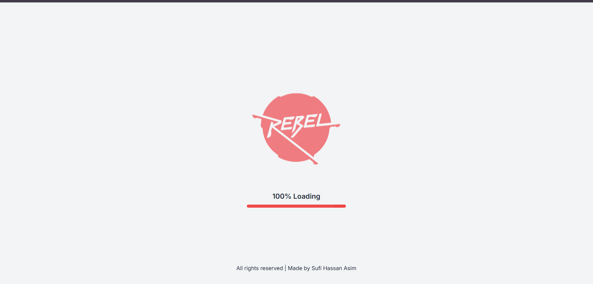
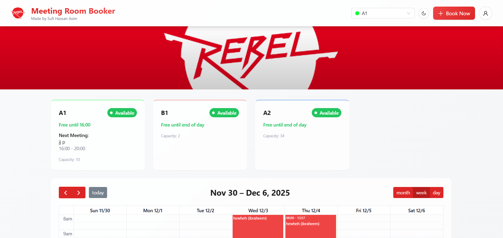
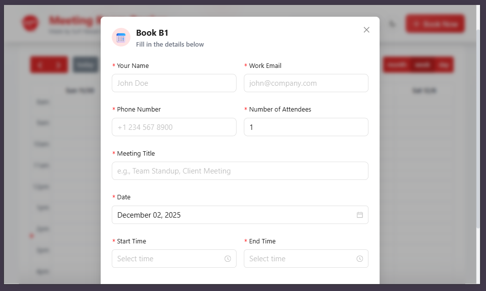
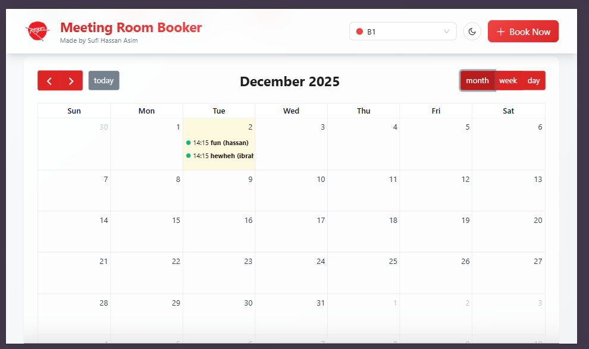
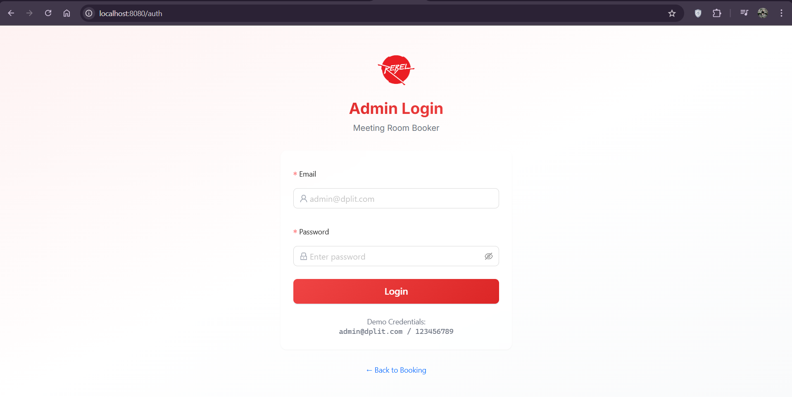
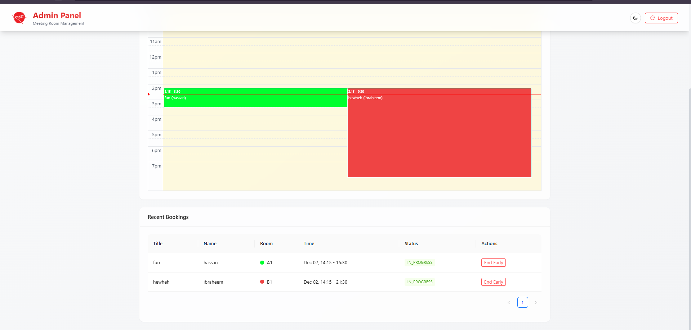
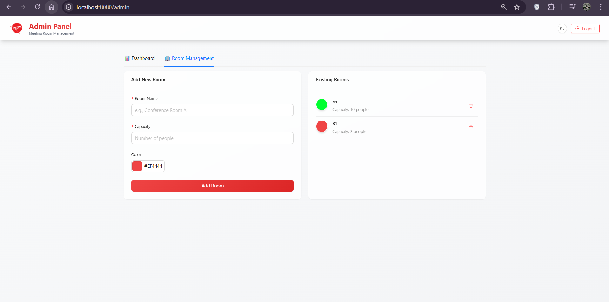

# Meeting Room Booker

A modern, production-ready meeting room booking system for scheduling and managing meetings across rooms. This repository contains a React + TypeScript frontend and a Node.js + Express backend with Prisma (SQLite) for local development.

---

## Table of contents
- [Demo & Screenshots](#demo--screenshots)
- [Features](#features)
- [Architecture](#architecture)
- [Tech Stack](#tech-stack)
- [Getting Started (Local)](#getting-started-local)
- [PWA / Install Instructions](#pwa--install-instructions)
- [API Endpoints](#api-endpoints)
- [Project Structure](#project-structure)
- [Troubleshooting & Notes](#troubleshooting--notes)
- [Future Enhancements](#future-enhancements)
- [License & Support](#license--support)

---

## Demo & Screenshots

Banner:


Logo:


Screenshots (from `public/`):

- Dashboard / Calendar
  
- Booking Flow
  
- Room List & Management
  
- Admin Bookings Table
  
- Mobile View / Responsive
  
- Booking Modal
  
- Settings / Theme
  

> Note: GitHub renders images from the repository; using `public/...` relative paths ensures images display correctly both in the repo and when served by Vite.

---

## Features

- Interactive calendar (FullCalendar) for day/week/month views
- Real-time updates using Socket.IO
- Admin panel with secure login (JWT) and room management
- Add/edit/delete rooms, set availability windows and slot durations
- Prevents double bookings and validates capacity/time constraints
- PWA support (installable, offline caching via service worker)
- Responsive UI with dark mode and Tailwind + Ant Design components

---

## Architecture

High level architecture showing frontend, backend, and realtime flow:

```mermaid
flowchart LR
  subgraph Client
    A[Browser / PWA]
  end
  B[Frontend (Vite + React)]
  C[Backend (Express)]
  D[(SQLite)]

  A -->|HTTP / WebSocket| B
  B -->|REST API| C
  C -->|Prisma| D
  C -->|Socket.IO| B

  style B fill:#f9f,stroke:#333,stroke-width:1px
  style C fill:#9ff,stroke:#333,stroke-width:1px
```

---

## Tech Stack

- Frontend: React 18, TypeScript, Vite, Ant Design, Tailwind CSS, FullCalendar
- Backend: Node.js, Express, Prisma (SQLite for local dev)
- Realtime: Socket.IO (client/server)
- PWA: vite-plugin-pwa (service worker + manifest)

---

## Getting Started (Local)

Prerequisites

- Node.js 18+ and npm

Install dependencies

```powershell
npm install
cd server
npm install
cd ..
```

Setup database (server)

```powershell
cd server
npx prisma db push
npx ts-node seed.ts
cd ..
```

Run the app

Open two terminals.

Terminal 1 — Backend:

```powershell
cd server
npm run dev
```

Terminal 2 — Frontend:

```powershell
npm run dev
```

Open the app at: `http://localhost:8080`

Admin panel: `http://localhost:8080/admin` (use the seeded admin credentials)

---

## PWA / Install Instructions

This app is configured as a Progressive Web App using `vite-plugin-pwa`. A few important notes:

1. During development the Vite PWA plugin was enabled in dev mode (`devOptions.enabled = true`). This allows the service worker and manifest to be served on `localhost` so the install flow can be tested.
2. The app registers the service worker using `virtual:pwa-register` in `src/main.tsx` so installation and updates are handled by the plugin.
3. The browser will only show the native install prompt when the following are true:
   - The page is served over a secure context (localhost qualifies)
   - A valid `manifest.webmanifest` is available and linked in `index.html`
   - A service worker is registered for the page
4. We also provide an in-app toast prompt that listens for the `beforeinstallprompt` event and shows an Install CTA on the home page.

How to test PWA install locally

1. Run `npm run dev` (dev mode has SW enabled). Open `http://localhost:8080` in Chrome.
2. Open DevTools → Application:
   - Check **Manifest** shows icons and properties.
   - Check **Service Workers** shows an active worker.
3. If `beforeinstallprompt` fires, you'll see an in-app install toast. You can also install via the browser menu (⋮ → Install app) if the site is considered installable.

If you want a production-preview test:

```powershell
npm run build
npm run preview

# Visit the preview URL (usually http://localhost:4173)
```

---

## API Endpoints

### Public
- `POST /api/bookings` - Create a new booking
- `GET /api/bookings` - Get bookings (with filters)

### Admin (requires JWT auth)
- `POST /api/admin/login` - Admin login
- `POST /api/admin/rooms` - Create room
- `PUT /api/admin/rooms/:id` - Update room
- `DELETE /api/admin/rooms/:id` - Delete room
- `GET /api/admin/bookings` - Get all bookings
- `PUT /api/admin/bookings/:id/end` - End meeting early

---

## Project Structure

```
room-booker-dpl/
├── src/                      # Frontend source
│   ├── components/           # React components
│   ├── pages/                # Page components (Admin, Index, etc.)
│   └── main.tsx              # Frontend entry
├── server/                   # Backend source
│   ├── src/
│   │   ├── routes/           # API routes
│   │   ├── index.ts          # Server entry
│   │   ├── scheduler.ts      # Meeting scheduler
│   │   └── socket.ts         # WebSocket setup
│   ├── prisma/
│   │   └── schema.prisma     # Database schema
│   └── seed.ts               # Database seeder (creates admin user)
└── public/                   # Static assets + screenshots
    ├── logo.png
    ├── banner.png
    ├── ss1.png
    ├── ss2.png
    ├── ss3.png
    ├── ss4.png
    ├── ss5.png
    ├── ss6.png
    └── ss7.png
```

---

## Troubleshooting & Notes

- If the calendar is empty: ensure the backend is running and bookings API returns results.
- If socket connections fail: verify backend is running on port 3000 and CORS is correctly configured.
- PWA install not showing: check DevTools → Application for manifest and service worker. Test via `npm run build && npm run preview` if needed.
- To reset seeded admin account (dev):

```powershell
cd server
npx ts-node seed.ts
```

---

## Future Enhancements

- Email notifications for bookings
- Recurring meetings support
- Room amenities and features
- User profiles and booking history
- Calendar export (iCal)
- Multi-language support
- Advanced analytics dashboard

---

## License & Support

This project was created by **Sufi Hassan Asim**. For questions or issues, please open an issue in this repository or contact the maintainer.
# Meeting Room Booker

A modern, production-ready meeting room booking management system built with React, TypeScript, Node.js, and Prisma.

**Made by Sufi Hassan Asim**

## Features

### User Features
- 📅 **Interactive Calendar** - View and book meeting rooms with an intuitive calendar interface
- 🎨 **Modern UI** - Beautiful red/white/charcoal theme with dark mode support
- 📱 **Responsive Design** - Works seamlessly on desktop, tablet, and mobile devices
- 🔄 **Real-time Updates** - Socket.IO integration for live booking updates
- ✅ **Smart Validation** - Prevents double bookings and validates capacity
- 🌓 **Dark Mode** - Toggle between light and dark themes

### Admin Features
- 🔐 **Secure Authentication** - JWT-based admin login with database-stored credentials
- 🏢 **Room Management** - Create, update, and delete meeting rooms
# Meeting Room Booker

A modern, production-ready meeting room booking system for scheduling and managing meetings across rooms. This repo contains a React + TypeScript frontend and a Node.js + Express backend with Prisma (SQLite) for local development.

---

## Table of contents
- [Demo & Screenshots](#demo--screenshots)
- [Features](#features)
- [Architecture](#architecture)
- [Tech Stack](#tech-stack)
- [Getting Started (Local)](#getting-started-local)
- [PWA / Install Instructions](#pwa--install-instructions)
- [API Endpoints](#api-endpoints)
- [Project Structure](#project-structure)
- [Troubleshooting & Notes](#troubleshooting--notes)
- [Future Enhancements](#future-enhancements)
- [License & Support](#license--support)

---

## Demo & Screenshots

Banner:


Logo:


Screenshots (from `/public`):

- Dashboard / Calendar
  
- Booking Flow
  
- Room List & Management
  
- Admin Bookings Table
  
- Mobile View / Responsive
  
- Booking Modal
  
- Settings / Theme
  

> Note: Files are served from the `public/` folder so the paths above work when running the dev server or preview build.

---

## Features

- Interactive calendar (FullCalendar) for day/week/month views
- Real-time updates using Socket.IO
- Admin panel with secure login (JWT) and room management
- Add/edit/delete rooms, set availability windows and slot durations
- Prevents double bookings and validates capacity/time constraints
- PWA support (installable, offline caching via service worker)
- Responsive UI with dark mode and Tailwind + Ant Design components

---

## Architecture

High level architecture showing frontend, backend, and realtime flow:

```mermaid
flowchart LR
  subgraph Client
    A[Browser / PWA] -->|HTTP / WebSocket| B[Frontend (Vite + React)]
  end
  B -->|REST API| C[Backend (Express)]
  C --> |Prisma| D[(SQLite)]
  C -->|Socket.IO| B
  style B fill:#f9f,stroke:#333,stroke-width:1px
  style C fill:#9ff,stroke:#333,stroke-width:1px
```

---

## Tech Stack

- Frontend: React 18, TypeScript, Vite, Ant Design, Tailwind CSS, FullCalendar
- Backend: Node.js, Express, Prisma (SQLite for local dev)
- Realtime: Socket.IO (client/server)
- PWA: vite-plugin-pwa (service worker + manifest)

---

## Getting Started (Local)

Prerequisites

- Node.js 18+ and npm

Install dependencies

```powershell
npm install
cd server
npm install
cd ..
```

Setup database (server)

```powershell
cd server
npx prisma db push
npx ts-node seed.ts
cd ..
```

Run the app

Open two terminals.

Terminal 1 — Backend:

```powershell
cd server
npm run dev
```

Terminal 2 — Frontend:

```powershell
npm run dev
```

Open the app at: `http://localhost:8080`

Admin panel: `http://localhost:8080/admin` (use the seeded admin credentials)

---

## PWA / Install Instructions

This app is configured as a Progressive Web App using `vite-plugin-pwa`. A few important notes:

1. During development the Vite PWA plugin was enabled in dev mode (`devOptions.enabled = true`). This allows the service worker and manifest to be served on `localhost` so the install flow can be tested.
2. The app registers the service worker using `virtual:pwa-register` in `src/main.tsx` so installation and updates are handled by the plugin.
3. The browser will only show the native install prompt when the following are true:
   - The page is served over a secure context (localhost qualifies)
   - A valid `manifest.webmanifest` is available and linked in `index.html`
   - A service worker is registered for the page
4. We also provide an in-app toast prompt that listens for the `beforeinstallprompt` event and shows an Install CTA on the home page.

How to test PWA install locally

1. Run `npm run dev` (dev mode has SW enabled). Open `http://localhost:8080` in Chrome.
2. Open DevTools → Application:
   - Check **Manifest** shows icons and properties.
   - Check **Service Workers** shows an active worker.
3. If `beforeinstallprompt` fires, you'll see an in-app install toast. You can also install via the browser menu (⋮ → Install app) if the site is considered installable.

If you want a production-preview test:

```powershell
npm run build
npm run preview

# Visit the preview URL (usually http://localhost:4173)
```

---

## API Endpoints

### Public
- `POST /api/bookings` - Create a new booking
- `GET /api/bookings` - Get bookings (with filters)

### Admin (requires JWT auth)
- `POST /api/admin/login` - Admin login
- `POST /api/admin/rooms` - Create room
- `PUT /api/admin/rooms/:id` - Update room
- `DELETE /api/admin/rooms/:id` - Delete room
- `GET /api/admin/bookings` - Get all bookings
- `PUT /api/admin/bookings/:id/end` - End meeting early

---

## Project Structure

```
room-booker-dpl/
├── src/                      # Frontend source
│   ├── components/           # React components
│   ├── pages/                # Page components (Admin, Index, etc.)
│   └── main.tsx              # Frontend entry
├── server/                   # Backend source
│   ├── src/
│   │   ├── routes/           # API routes
│   │   ├── index.ts          # Server entry
│   │   ├── scheduler.ts      # Meeting scheduler
│   │   └── socket.ts         # WebSocket setup
│   ├── prisma/
│   │   └── schema.prisma     # Database schema
│   └── seed.ts               # Database seeder (creates admin user)
└── public/                   # Static assets + screenshots
    ├── logo.png
    ├── banner.png
    ├── ss1.png
    ├── ss2.png
    ├── ss3.png
    ├── ss4.png
    ├── ss5.png
    ├── ss6.png
    └── ss7.png
```

---

## Troubleshooting & Notes

- If the calendar is empty: ensure the backend is running and bookings API returns results.
- If socket connections fail: verify backend is running on port 3000 and CORS is correctly configured.
- PWA install not showing: check DevTools → Application for manifest and service worker. Test via `npm run build && npm run preview` if needed.
- To reset seeded admin account (dev):

```powershell
cd server
npx ts-node seed.ts
```

---

## Future Enhancements

- Email notifications for bookings
- Recurring meetings support
- Room amenities and features
- User profiles and booking history
- Calendar export (iCal)
- Multi-language support
- Advanced analytics dashboard

---

## License & Support

This project was created by **Sufi Hassan Asim**. For questions or issues, please open an issue in this repository or contact the maintainer.
